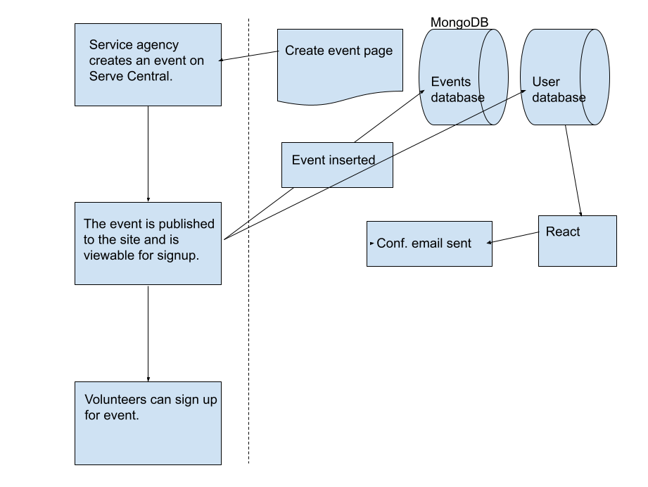
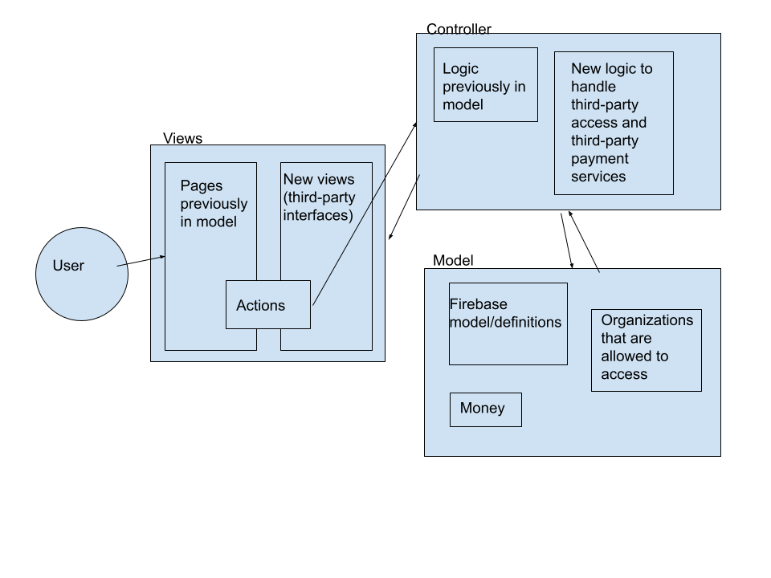

# Lab Report: Continuous Integration
___
**Course:** CIS 411, Spring 2021  
**Instructor(s):** [Trevor Bunch](https://github.com/trevordbunch)  
**Name:** Your Name  
**GitHub Handle:** Your GitHub Handle  
**Repository:** Your Forked Repository  
**Collaborators:** Robbie Dorsey
___

# Step 1: Confirm Lab Setup
- [x] I have forked the repository and created my lab report
- [x] I have reviewed the [lecture / discsussion](../assets/04p1_SolutionArchitectures.pdf) on architecture patterns.
- [x] If I'm collaborating on this project, I have included their handles on the report and confirm that my report is informed, but not copied from my collaborators.

# Step 2: Analyze the Proposal
Serve Central is a volunteer service aggregate platform that matches volunteers with work that needs it. It will be built on a Firebase database and the React framework.

## Step 2.1 Representative Use Cases  

| Use Case #1 | |
|---|---|
| Title | UC-1 Volunteer looking for work |
| Description / Steps | As a user, I need to be able to sign up for events from a list.  1. Volunteer creates an account with ServeCentral. 2. Volunteer navigates through list of events and chooses one. 3. Volunteer signs up for event. |
| Primary Actor | Volunteer |
| Preconditions | 1. The signup protocol is implemented and working. 2. The events database is up-to-date and can be viewed from the app. 3. The database is able to accept username and email after signing up for an event. |
| Postconditions | 1. The user information is put into the database. 2. The service agency is notified of the new volunteer. 3. A confirmation email is sent to the user to remind them of the event. |

| Use Case #2 | |
|---|---|
| Title | UC-2 Service agency looking for volunteers |
| Description / Steps | As a service agency, I need to able to create events and publish them.  1. Service agency creates an event on Serve Central. 2. The event is published to the site and is visible for signup.|
| Primary Actor | Service agent |
| Preconditions | 1. Users flagged as service agencies are able to access event creation. 2. Database is able to accept new events. |
| Postconditions | 1. Service agency sent a comfirmation email. 2. Volunteers are able to sign up for the event. |

## Step 2.2 Define the MVC Components

| Model | View | Controller |
|---|---|---|
| Users (names and emails, passwords) | Profile | React |
| Events (location, time) | Map | Logic handling database updates/publishing |
| User types (volunteer/agency) | Events | Confirmation emails |
| Volunteers for events (cross-referenced with Users) | Sign up for event | Logic re:users flagged as agencies able to see agency-related views |
| MongoDB | Sign up for account |  |
|  | Landing page |  |
|  | Create event |  |

## Step 2.3 Diagram a Use Case in Architectural Terms

# Step 3: Enhancing an Architecture

## Step 3.1 Architecture Change Proposal
A total architectural overhaul seems unnecessary in this case. Stripe embedding and like services certainly do not warrant one and creating a way for third parties to interface with the database should not interfere with the current architecture in significant ways. Remaining in MVC arch primarily prevents unecessary work, by allowing the MVC arch to be preserved and keep code optimized. Unfortunately, organization-specific interfaces may be difficult to handle (multiple similar views).

## Step 3.2 Revised Architecture Diagram

# Step 4: Scaling an Architecture
INSERT Architectural change proposal here, and how it meets the four new requirements.  Explain both the benefits and draw backs of your proposal.  If the changes are significant, then you need to explain why the changes are necessary versus a nice-to-have enhancement.

As Serve Central expands and grows, and in accordance with the proposed changes, I recommend a Blackboard architecture. The reason I propose moving away from MVC is simply that it will not handle the data and queries quite as well. Blackboard architecture does well with large amounts of data, and does not suffer the speed drawbacks that other architechtures do (because of the brokered arch). As new queries and data come in, so long as the underlying event/user data models do not change, speed and data quality should not suffer. Unfortunately, being a change from MVC, shifting to Blackboard may cause a few headaches, but it should be very doable. 

# Extra Credit
I'm not sure if you're still accepting typos as extra credit, but in the ServeCentral PDF, on page 6: "User can create and account."
Otherwise, I noticed that in Slack some classmates were confused about the requirements of step 2.2. I think an easy fix to this might be to only require 3 of each and fill the first row with an example.