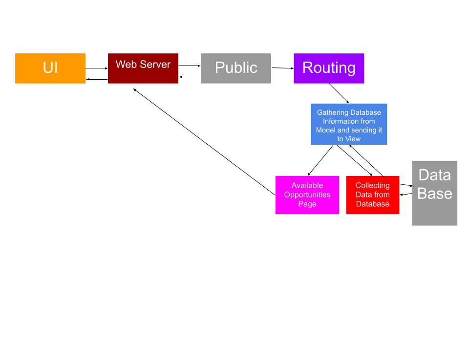
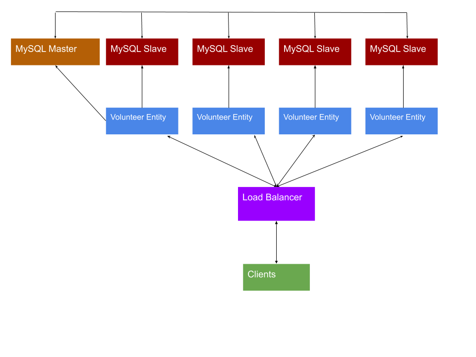

# Lab Report Template for CIS411_Lab1
Course: Messiah College CIS 411, Fall 2018
Instructors: [Joel Worrall](https://github.com/tangollama) & [Trevor Bunch](https://github.com/trevordbunch)
Name: Sam Gulinello
GitHub: [YOUR_HANDLE](https://github.com/SamGulinello)
(if appropriate) Collaborators: N/A

# Step 0: Reviewing Architectural Patterns
See the [lecture / discussion](https://docs.google.com/presentation/d/1nUcy63FWPFYO3OJmERJpMjEtdaFtaIBbuUkpmNRVRas/edit#slide=id.g45345bd5ea_0_136) from CIS 411. You'll need to be familiar with the content from this lecture to complete this assignment.

Note: you are free to work with classmates on this assignment. _Good architecture is born out of collaboration - not reclusive mad-scientist behavior._ However, if you work with colleagues:

1. You must specifically note your collaborators by name at the top of your report.
2. You may not completely copy each others work (diagrams and descriptions, even if your solutions are identical).

# Step 1: MVC Architecture
Review the proposals for the Serve Central project. Let's imagine that the project has been granted (relatively) unlimited resources if they can deliver a version 1 release in 120 days. As a result, the team decides to implement an MVC architecture for its version 1 release, delivering functionality through a [responsive web application](https://en.wikipedia.org/wiki/Responsive_web_design). 

Based on the [this](https://docs.google.com/presentation/d/1UnU0xU0wF1l8pAB8trtLpdM0yuskx66jTFJzd64nsjU/edit#slide=id.g439b9c6866_2_53) and [this](https://docs.google.com/presentation/d/1-VZfAFoBVr6ijNepKAtRA7JoAQsV2Jlbf2l1WPDMhI0/edit) presentation:

1) Document two use cases of your choosing

| Use Case #1 | |
|---|---|
| Title | As a volunteer I want to be able to search for opoortunities in my area.  |
| Description / Steps | The user will navigate to an interactive map showing all of the locations of available opportunities within a specified area. Then the user can select locations on the map to give more information about the opportunity going on.|
| Primary Actor | The User |
| Preconditions | Events have been loaded into the database.|
| Postconditions | Results were presented to the user. The user gained information on available volunteering opportunities. |

| Use Case #2 | |
|---|---|
| Title | A a user I want to be able to track my past service activies. |
| Description / Steps | At this point the user has participated in multiple activies and wants to view certain information about their past service activities. The user will go to a page on the app that gives the desired information. |
| Primary Actor | The User|
| Preconditions | The user has participated in activities. Those service projects have been recorded in the application.|
| Postconditions | The user gets desired information. |

2) Highlight a [table](https://www.tablesgenerator.com/markdown_tables) of at least **four models, views, and controllers** needed to produce this project.

| Model | View | Controller |
|---|---|---|
| Database of Opportunities                                 | Available Opportunities Page |                 Takes data from model and loads it into view                  |
| Database of Recent Work                                   | Recent Work Page             | Loads data and creates visual representation of data for user to view          |
| Database of Profile Data and Software to Create Analysis Data | Profile Page                 | Routes to profile page downloads  database info and loads it into Profile Page |
| Database of Opportunity Data                              | Individual Opportunity Page  | Loads modal of Opportunity Data                                                |

3) Generate and [embed](https://github.com/adam-p/markdown-here/wiki/Markdown-Cheatsheet#images) at least one diagram of the interaction between an Actor from the Use Cases, and one set of Model(s), View(s), and Controller(s) from the proposed architecture, including all the related / necessary services (ex: data storage and retrieval, web servers, container tech, etc.)

_Note: You are free to use any diagraming tool and framework that you want as long as it clearly communicates the concept. I typically use a UML System Use Case or [UML Sequence Diagram](https://www.uml-diagrams.org/index-examples.html).  If you do not have a preferred diagramming tool: [draw.io](http://draw.io) or [lucidchart](http://lucidchart.com) are good cloud-based options._

# Step 2: Enhancing an Architecture
After an initial release and a few months of operation, Serve Central encounters a tremendous growth opportunity to extend their service and provide a volunteer recuitment and management interface to __four__ of the primary volunteer entities in the United States. As such, a reevaluation of the architecture is required, one that allows:

1. Thirdparty services to both input and retrieve data from the Serve Central model/datastore. (For instance, receiving volunteer opportunities from United Way chapters across the country.)
2. Building organization-specific interfaces on top of the Serve Central business and data logic. (For instance, allowing the registration services of Serve Central to be embedded in the website of local churches, [ah-la Stripe embedding](https://stripe.com/payments/elements).)

To support these objectives:
1. What architectural patterns (either of those presented in class on based on your own research) are appropriate? Justify your response, highlighting your presumed benefits / capabilties of your chosen architecture(s) **as well as as least one potential issue / adverse consequence** of your choice.

I belive that "Master-Slave" would be the best architecture option. It would allow thirdparty services to retrieve the information from their MySQL Slave and do with it what they want. "Master-Slave" is also very good because it allows for new serviced to be added on very easily by just adding another slave. The downside to it though is that there could be latency between the slaves.

2. Using your preferred diagramming tool, generate a diagram of the new Serve Central architecture that supports these two new requirements.

# Step 3: Scaling an Architecture
18 months into the future, Serve Central is experiencing profound growth in the use of the service with more than 100k daily, active users and nearly 1M event registrations per month. As a result, the [Gates Foundation](https://www.gatesfoundation.org/) has funded a project to build and launch a mobile application aimed at encouraging peer-to-peer volunteer opportunity promotion and organization. 

In addition to building a new mobile application interface, the grant requires that the project prepare for the following future needs:

1. Consuming bursts of 10k+ new volunteer opportunities per hour with a latency of less than 15 seconds between submitting an opportunity and it's availability in the registration service.
2. Supporting a volunteer and event data store that will quickly exceed 50TB of data
3. Allowing authorized parties to issue queries that traverse the TB's of data stored in your datastore(s).
4. Enabling researchers to examine patterns of volunteer opportunities as a way of determining future grant investments.

What archictural pattern(s) will you employee to support each of these needs? What will the benefits and consequences be? Why are changes needed at all? Justify your answers.

Since there would now hypothetically be a big amount of data flowing through the system, a master slave architecture will no longer work. Due to the latency of that type of architecture, the system would be prone to failing and causing slow user experiences. The solution I would propose would be to implement a broker system. These architectures are designed to manage large sets of data and would still allow for many third party services to use the application. Now that the program is no longer small, the overhead would be manageable by the company.

# Extra Credit
1. Create and embed a comprehensive diagram of your final architecture (i.e. one that meets all the requirements of this lab, including Step 3).
2. Augment/improve the assignment. Suggest meaningful changes in the assignment and highlight those changes in the extra credit portion of your lab report.