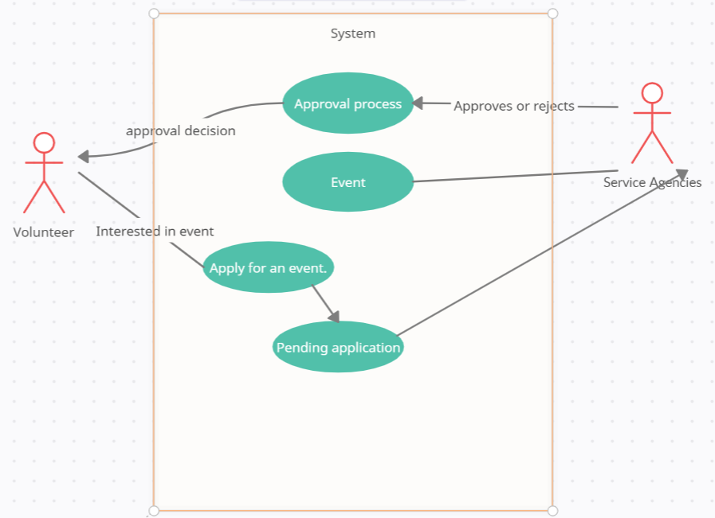

# Lab Report: Continuous Integration
___
**Course:** CIS 411, Spring 2021  
**Instructor(s):** [Trevor Bunch](https://github.com/trevordbunch)  
**Name:** Bryan Chang  
**GitHub Handle:** Triggum  
**Repository:** cis411_lab2_arch  
**Collaborators:** 
___

# Step 1: Confirm Lab Setup
- [done] I have forked the repository and created my lab report
- [done] I have reviewed the [lecture / discsussion](../assets/04p1_SolutionArchitectures.pdf) on architecture patterns.
- [] If I'm collaborating on this project, I have included their handles on the report and confirm that my report is informed, but not copied from my collaborators.

# Step 2: Analyze the Proposal
Serve Central allows for a volunteer to find volunteering opportunities and apply for them. The user can see the event, service agency information and apply conveniently in one app.

## Step 2.1 Representative Use Cases  

| Use Case #1 |ID:UC-1|
|---|---|
| Title |
Applying to volunteer|

| Description / Steps |
Description: The volunteer fills out the necessary information to apply and submits it. The system processess the request by forwarding it to the respective service agencies for approval

Steps:
1.0. Applying to volunteer for an event
    1. The volunteer looks for an event they are interested in and applies for it.
    2. The system notifies the service agency of the application.
    3. The system stores the application in the pending application database|
   
| Primary Actor |
The volunteer|

| Preconditions | 
  1. The Volunteer has their identity authenticated.
  2. The event is open for application.
  3. The pending application database is up-to-date and on-line|
| Postconditions |
  1. The request is approved or refused by the service agency
  2. The volunteer is notified of the approval decision.
    2.1. If approved, event details are given. |

| Use Case #2 |ID: UC-2 |
|---|---|
| Title |
Creating an event|

| Description / Steps |
Description: The service agencies creates an event to recruit volunteers by stating information about the event like the event title, which area of service its serving and location of the event

Steps: 
  1.0 Service agency creates an event
    1. The service agency specifies the event details and the reason for the event
    2. The system stores the event in the organization database.
    3. The system notifies users in the area that a new event is open.
    4. The system opens up the event for applicants.|

| Primary Actor |Service Agencies|

| Preconditions |
  1. The service agency's identity is authenticated.
  2. The service agency has a valid event being held.
  3. The organization database is up-to-date and on-line.|
   
| Postconditions |
  1. The system notifies the service agency about the confirmation of the event.
  2. The event is stored in the organization database.
  3. The volunteers are notified of a new event |

## Step 2.2 Define the MVC Components

|   Model   |           View          |  Controller |
|:---------:|:-----------------------:|:-----------:|
|  MongoDB  | Firebase + React Native |  Express.js |
|  RavenDB  |        Bootstrap        |   ember.js  |
| RethinkDB |          Ionic          | Backbone.js |
|  OrientDB |      Apache Cordova     | Knockout.js |

## Step 2.3 Diagram a Use Case in Architectural Terms
* The process of a Volunteer applying for an event.
 

# Step 3: Enhancing an Architecture

## Step 3.1 Architecture Change Proposal
INSERT Architectural change proposal here, and how it meets the two new requirements.  Explain both the benefits and draw backs of your proposal.

## Step 3.2 Revised Architecture Diagram
INSERT IMAGE HERE with a Description.

# Step 4: Scaling an Architecture
INSERT Architectural change proposal here, and how it meets the four new requirements.  Explain both the benefits and draw backs of your proposal.  If the changes are significant, then you need to explain why the changes are necessary versus a nice-to-have enhancement.

# Extra Credit
If you opt to do extra credit, then include it here.