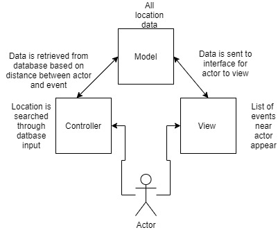
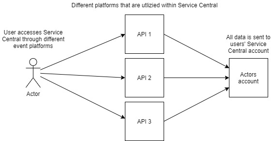

# Lab Report Template for CIS411_Lab1
Course: Messiah College CIS 411, Fall 2018
Instructors: [Joel Worrall](https://github.com/tangollama) & [Trevor Bunch](https://github.com/trevordbunch)
Name: Eddie Daniel
GitHub: [eddiedaniel](https://github.com/YOUR_HANDLE)
(if appropriate) Collaborators:

# Step 0: Reviewing Architectural Patterns
See the [lecture / discussion](https://docs.google.com/presentation/d/1nUcy63FWPFYO3OJmERJpMjEtdaFtaIBbuUkpmNRVRas/edit#slide=id.g45345bd5ea_0_136) from CIS 411. You'll need to be familiar with the content from this lecture to complete this assignment.

Note: you are free to work with classmates on this assignment. _Good architecture is born out of collaboration - not reclusive mad-scientist behavior._ However, if you work with colleagues:

1. You must specifically note your collaborators by name at the top of your report.
2. You may not completely copy each others work (diagrams and descriptions, even if your solutions are identical).

# Step 1: MVC Architecture
Review the proposals for the Serve Central project. Let's imagine that the project has been granted (relatively) unlimited resources if they can deliver a version 1 release in 120 days. As a result, the team decides to implement an MVC architecture for its version 1 release, delivering functionality through a [responsive web application](https://en.wikipedia.org/wiki/Responsive_web_design). 

Based on the [this](https://docs.google.com/presentation/d/1UnU0xU0wF1l8pAB8trtLpdM0yuskx66jTFJzd64nsjU/edit#slide=id.g439b9c6866_2_53) and [this](https://docs.google.com/presentation/d/1-VZfAFoBVr6ijNepKAtRA7JoAQsV2Jlbf2l1WPDMhI0/edit) presentation:

1) Document two use cases of your choosing

| Use Case #1 | |
|---|---|
| Title | Users want to see places to volunteer at near them |
| Description / Steps | User creates account by utilizing a username and password, User logs in using thier newly created credentials|
| Primary Actor | Volunteer |
| Preconditions | Database is connected to allow users to add account information, User enters account information correctly when logging in |
| Postconditions | Users receive confirmation email, Users are able to see events near them periodically and log in successfully|

| Use Case #2 |  |
|---|---|
| Title | Users want to be able to see the hours they spent volunteering |
| Description / Steps | Users log in to their accounts, users find the event that they volunteered for, category that event planner specified is already set and users can just log that event and how much time they spent|
| Primary Actor |Volunteer |
| Preconditions | User goes to event and makes sure it actually occurred. User logs duration of time served|
| Postconditions | User see their logged hours as well as categories of what they volunteerd for in each specific location|

2) Highlight a [table](https://www.tablesgenerator.com/markdown_tables) of at least **four models, views, and controllers** needed to produce this project.

| Model| View| Controller |
|---|---|---|
| Event planners want to see a list of volunteers for their event|Database selects all users that regisered for an event | List of all volunters from specifc event show up|
| Users want to see what type of places they can volunteer at | Database gathers field data of each event| users see what category each event is in |
| Users want to see how many hours they have volunteered | Users sign in and it retreives data from databases | List of hours shows up |
| Users want to see events near them | Users put location data into search field | Locations come up |

3) Generate and [embed](https://github.com/adam-p/markdown-here/wiki/Markdown-Cheatsheet#images) at least one diagram of the interaction between an Actor from the Use Cases, and one set of Model(s), View(s), and Controller(s) from the proposed architecture, including all the related / necessary services (ex: data storage and retrieval, web servers, container tech, etc.)

_Note: You are free to use any diagraming tool and framework that you want as long as it clearly communicates the concept. I typically use a UML System Use Case or [UML Sequence Diagram](https://www.uml-diagrams.org/index-examples.html).  If you do not have a preferred diagramming tool: [draw.io](http://draw.io) or [lucidchart](http://lucidchart.com) are good cloud-based options._

# Step 2: Enhancing an Architecture
After an initial release and a few months of operation, Serve Central encounters a tremendous growth opportunity to extend their service and provide a volunteer recuitment and management interface to __four__ of the primary volunteer entities in the United States. As such, a reevaluation of the architecture is required, one that allows:

1. Thirdparty services to both input and retrieve data from the Serve Central model/datastore. (For instance, receiving volunteer opportunities from United Way chapters across the country.)
2. Building organization-specific interfaces on top of the Serve Central business and data logic. (For instance, allowing the registration services of Serve Central to be embedded in the website of local churches, [ah-la Stripe embedding](https://stripe.com/payments/elements).)

To support these objectives:
1. What architectural patterns (either of those presented in class on based on your own research) are appropriate? Justify your response, highlighting your presumed benefits / capabilties of your chosen architecture(s) **as well as as least one potential issue / adverse consequence** of your choice.

Integration architecture is a software architecture that facilitates the integration of multiple IT components. This architecture changes with the advances in cross-platform utility and other development paradigms for new kinds of digital operations.

In terms of the lectures slide I beleive the microservice architecture would work as well being that their could be many different organaziations connected to Serve Centrals application and would allow them to cross platform or use API's for better integration of their platforms.

One potential issue of this however is that there may be numerous amount of different technollogies and API's used in this architecture that may pose challenges when it comes to aggregating them togehter. It may be challenging to Servcie Central everytime they want to add a new platform to their site becasue they have to make sure it works with all the other exisiting ones.

2. Using your preferred diagramming tool, generate a diagram of the new Serve Central architecture that supports these two new requirements.

# Step 3: Scaling an Architecture
18 months into the future, Serve Central is experiencing profound growth in the use of the service with more than 100k daily, active users and nearly 1M event registrations per month. As a result, the [Gates Foundation](https://www.gatesfoundation.org/) has funded a project to build and launch a mobile application aimed at encouraging peer-to-peer volunteer opportunity promotion and organization. 

In addition to building a new mobile application interface, the grant requires that the project prepare for the following future needs:

1. Consuming bursts of 10k+ new volunteer opportunities per hour with a latency of less than 15 seconds between submitting an opportunity and it's availability in the registration service.
2. Supporting a volunteer and event data store that will quickly exceed 50TB of data
3. Allowing authorized parties to issue queries that traverse the TB's of data stored in your datastore(s).
4. Enabling researchers to examine patterns of volunteer opportunities as a way of determining future grant investments.

What archictural pattern(s) will you employee to support each of these needs? What will the benefits and consequences be? Why are changes needed at all? Justify your answers.

You will need to have more capacity in order for the application to run smoothly. Having more daily users will eventually effect the storage capabilties of the application and therefore will need to upgraded.  

A peer to peer architectural pattern could be utilized for the quieres into data stores so that each datastore is disperesed evenly towards pleople trying to access it. GraphQL could also be utlized for users accesing from different mediums. 

Benefits will be, better access and storage for users and Service Central itself. Coseqeusnces could be having mulitple systems ijtegrated into Service Central that may be tough to manage. 

# Extra Credit
1. Create and embed a comprehensive diagram of your final architecture (i.e. one that meets all the requirements of this lab, including Step 3).
2. Augment/improve the assignment. Suggest meaningful changes in the assignment and highlight those changes in the extra credit portion of your lab report.