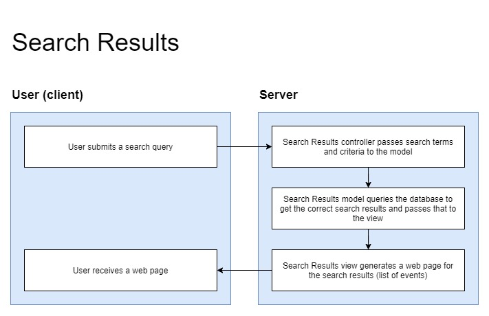
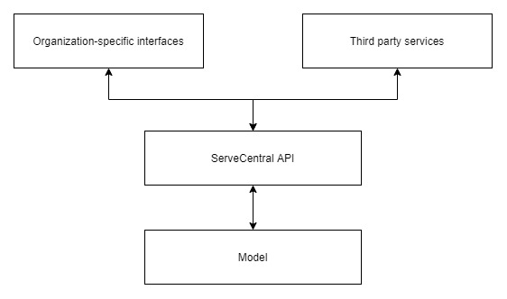
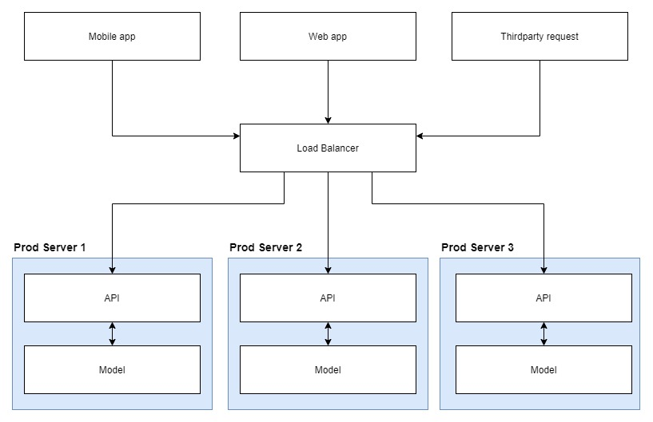

# Lab Report Template for CIS411_Lab1
Course: Messiah College CIS 411, Fall 2018
Instructors: [Joel Worrall](https://github.com/tangollama) & [Trevor Bunch](https://github.com/trevordbunch)<br>
Name: Eric Weischedel<br>
GitHub: [eric-weischedel](https://github.com/eric-weischedel)<br>
Collaborators: Nik Mourelatos, Tanner Stern


# Step 0: Reviewing Architectural Patterns
See the [lecture / discussion](https://docs.google.com/presentation/d/1nUcy63FWPFYO3OJmERJpMjEtdaFtaIBbuUkpmNRVRas/edit#slide=id.g45345bd5ea_0_136) from CIS 411. You'll need to be familiar with the content from this lecture to complete this assignment.

Note: you are free to work with classmates on this assignment. _Good architecture is born out of collaboration - not reclusive mad-scientist behavior._ However, if you work with colleagues:

1. You must specifically note your collaborators by name at the top of your report.
2. You may not completely copy each others work (diagrams and descriptions, even if your solutions are identical).

# Step 1: MVC Architecture
Review the proposals for the Serve Central project. Let's imagine that the project has been granted (relatively) unlimited resources if they can deliver a version 1 release in 120 days. As a result, the team decides to implement an MVC architecture for its version 1 release, delivering functionality through a [responsive web application](https://en.wikipedia.org/wiki/Responsive_web_design). 

Based on the [this](https://docs.google.com/presentation/d/1UnU0xU0wF1l8pAB8trtLpdM0yuskx66jTFJzd64nsjU/edit#slide=id.g439b9c6866_2_53) and [this](https://docs.google.com/presentation/d/1-VZfAFoBVr6ijNepKAtRA7JoAQsV2Jlbf2l1WPDMhI0/edit) presentation:

1) Document two use cases of your choosing

| Use Case #1 | |
|---|---|
| Title | As a volunteer, I want to search for service opportunities nearby so that I can serve at them. |
| Description / Steps | 1. Enter keywords<br> 2. Select search radius<br> 3. Submit search |
| Primary Actor | User looking to volunteer |
| Preconditions | - The user has logged into the app.<br> - There are events in the database. |
| Postconditions | - Search results are displayed.<br> |

| Use Case #2 | |
|---|---|
| Title | As a volunteer, I want to sign up for service opportunities so that I can serve at them. |
| Description / Steps | 1. Input fields necessary for registration<br> 2. Press submit button |
| Primary Actor | User looking to volunteer |
| Preconditions | - User has logged into the app. <br> - User has searched for events and found one to sign up for. |
| Postconditions | - The backend registers the user for the event.<br> - A *success* view is displayed.<br> - A confirmation email is sent to the user.<br> |


2) Highlight a [table](https://www.tablesgenerator.com/markdown_tables) of at least **four models, views, and controllers** needed to produce this project.

| Model | View | Controller |
|---|---|---|
| Authentication model: queries the database to authenticate the user| Log In view: username and password form | Log In controller: routes the user to the home page |
| Search Results model: gets search results from the database given the search criteria | Search Results view: list of events given the specified search criteria | Search Results controller: passes search terms, as long as they are not blank, to the model and routes the user to the results page |
| Event Details model: gets event details from the database for the given event | Event Details view: shows in-depth information about a given event | Event Details controller: passes event ID to the model and routes the user to the event details page |
| Event Registration model: sends user's registration information to the database | Event Registration view: input fields for user to register | Event Registration controller: passes registration information to the model and routes the user to the success screen |

3) Generate and [embed](https://github.com/adam-p/markdown-here/wiki/Markdown-Cheatsheet#images) at least one diagram of the interaction between an Actor from the Use Cases, and one set of Model(s), View(s), and Controller(s) from the proposed architecture, including all the related / necessary services (ex: data storage and retrieval, web servers, container tech, etc.)



# Step 2: Enhancing an Architecture
After an initial release and a few months of operation, Serve Central encounters a tremendous growth opportunity to extend their service and provide a volunteer recuitment and management interface to __four__ of the primary volunteer entities in the United States. As such, a reevaluation of the architecture is required, one that allows:

1. Thirdparty services to both input and retrieve data from the Serve Central model/datastore. (For instance, receiving volunteer opportunities from United Way chapters across the country.)
2. Building organization-specific interfaces on top of the Serve Central business and data logic. (For instance, allowing the registration services of Serve Central to be embedded in the website of local churches, [ah-la Stripe embedding](https://stripe.com/payments/elements).)

To support these objectives:
1. What architectural patterns (either of those presented in class on based on your own research) are appropriate? Justify your response, highlighting your presumed benefits / capabilties of your chosen architecture(s) **as well as as least one potential issue / adverse consequence** of your choice.<br><br>
Serve Central should create a web API. It would allow thirdparty services to both input and retrieve data from the database, and it would allow companies to build their own interfaces on top of the Serve Central business logic. There could be an API endpoint for each function that a company would need to perform. This would satisfy both of the new requirements. One potential issue is that it requires companies to figure out how to use it, especially if they don't already have API experience.
```
http://servecentral.com/getEvent?eventId=123
http://servecentral.com/createEvent?title=Backyard&description=...
http://servecentral.com/registerUser?userId=456&eventId=123
```
2. Using your preferred diagramming tool, generate a diagram of the new Serve Central architecture that supports these two new requirements.



# Step 3: Scaling an Architecture
18 months into the future, Serve Central is experiencing profound growth in the use of the service with more than 100k daily, active users and nearly 1M event registrations per month. As a result, the [Gates Foundation](https://www.gatesfoundation.org/) has funded a project to build and launch a mobile application aimed at encouraging peer-to-peer volunteer opportunity promotion and organization. 

In addition to building a new mobile application interface, the grant requires that the project prepare for the following future needs:

1. Consuming bursts of 10k+ new volunteer opportunities per hour with a latency of less than 15 seconds between submitting an opportunity and it's availability in the registration service.
2. Supporting a volunteer and event data store that will quickly exceed 50TB of data
3. Allowing authorized parties to issue queries that traverse the TB's of data stored in your datastore(s).
4. Enabling researchers to examine patterns of volunteer opportunities as a way of determining future grant investments.

What archictural pattern(s) will you employ to support each of these needs? What will the benefits and consequences be? Why are changes needed at all? Justify your answers.

These new requirements will break the existing setup because there would be too much traffic. The servers would not be able to handle that many requests. Therefore, a change in the architecture is needed. In order to solve this problem, Serve Central needs to get much more computing power and storage and employ *load balacing*. With load balancing, traffic can automatically be spread across all of Serve Central's servers so that any one server does not get overloaded.
- Benefits
  - Satisfies the new requirements
  - Increased performance
  - Expandable by adding more servers
  - Good long-term solution
- Consequences
  - Expensive
  - Time-consuming
  - If the load balancer gets overloaded, the whole system fails
  - Potential debugging complications

# Extra Credit
1. Create and embed a comprehensive diagram of your final architecture (i.e. one that meets all the requirements of this lab, including Step 3).



2. Augment/improve the assignment. Suggest meaningful changes in the assignment and highlight those changes in the extra credit portion of your lab report.