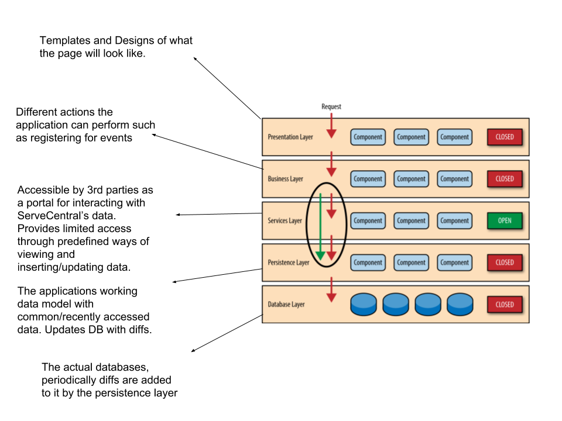

# Lab Report Template for CIS411_Lab1
Course: Messiah College CIS 411, Fall 2018
Instructors: [Joel Worrall](https://github.com/tangollama) & [Trevor Bunch](https://github.com/trevordbunch)
Name: [Jared Butler](https://github.com/jb1763)

(if appropriate) Collaborators: [Names of colleagues you worked with on this assignment]
*N/A*

# Step 0: Reviewing Architectural Patterns
See the [lecture / discussion](https://docs.google.com/presentation/d/1nUcy63FWPFYO3OJmERJpMjEtdaFtaIBbuUkpmNRVRas/edit#slide=id.g45345bd5ea_0_136) from CIS 411. You'll need to be familiar with the content from this lecture to complete this assignment.

Note: you are free to work with classmates on this assignment. _Good architecture is born out of collaboration - not reclusive mad-scientist behavior._ However, if you work with colleagues:

1. You must specifically note your collaborators by name at the top of your report.
2. You may not completely copy each others work (diagrams and descriptions, even if your solutions are identical).

# Step 1: MVC Architecture
Review the proposals for the Serve Central project. Let's imagine that the project has been granted (relatively) unlimited resources if they can deliver a version 1 release in 120 days. As a result, the team decides to implement an MVC architecture for its version 1 release, delivering functionality through a [responsive web application](https://en.wikipedia.org/wiki/Responsive_web_design).

Based on the [this](https://docs.google.com/presentation/d/1UnU0xU0wF1l8pAB8trtLpdM0yuskx66jTFJzd64nsjU/edit#slide=id.g439b9c6866_2_53) and [this](https://docs.google.com/presentation/d/1-VZfAFoBVr6ijNepKAtRA7JoAQsV2Jlbf2l1WPDMhI0/edit) presentation:

1) Document two use cases of your choosing

| Use Case #1 | A volunteer must be able to find events based on filter criteria. |
|---|---|
| Title | Finding an event|
| Description / Steps | 1) A volunteer sees a map of the area near them with pins representing events near them. 2) A volunteer can select a pin and see information about an event. 3) A volunteer can filter by type of event, organization, date & times etc. 4) A volunteer can search for a map of a different city/town. |
| Primary Actor | Volunteer |
| Preconditions | Filter criteria set|
| Postconditions | Displays map with event pins that match filter criteria|

| Use Case #2 | A volunteer must be able to change their profile information |
|---|---|
| Title | Changing profile information |
| Description / Steps |1) A volunteer navigates to a page where they are able to see the current information they have attached to their profile (Phone number, email, other info necessary to register for volunteer activities). 2) A volunteer can edit these fields. 3) The volunteer confirms changes and they are saved in the database.|
| Primary Actor | Volunteer |
| Preconditions | 1) Volunteer has a profile. |
| Postconditions | 1) The data being on the current view is updated. 2) The data in the Volunteer Data Model is updated. 3) The changes are made in the actual Data Warehouse.|

2) Highlight a [table](https://www.tablesgenerator.com/markdown_tables) of at least **four models, views, and controllers** needed to produce this project.

| Model | View | Controller |
|---|---|---|
| Volunteer Data | Profile Page | Fills Variable Fields in template with the particular volunteers data. |
| Volunteer Data | Profile Page | Changes Data in the Volunteer Data Model based on changes made by that volunteer after they have confirmed changes. |
| Event Data | Event Map | Display event information for an event when pin is selected. |
| Event Data | Map | Only display the event pins that meet the filter criteria. |

3) Generate and [embed](https://github.com/adam-p/markdown-here/wiki/Markdown-Cheatsheet#images) at least one diagram of the interaction between an Actor from the Use Cases, and one set of Model(s), View(s), and Controller(s) from the proposed architecture, including all the related / necessary services (ex: data storage and retrieval, web servers, container tech, etc.)

Disclaimer, I have never done Architecture diagrams, and I am not sure exactly what kind of a thing you are looking for.

_Note: You are free to use any diagraming tool and framework that you want as long as it clearly communicates the concept. I typically use a UML System Use Case or [UML Sequence Diagram](https://www.uml-diagrams.org/index-examples.html).  If you do not have a preferred diagramming tool: [draw.io](http://draw.io) or [lucidchart](http://lucidchart.com) are good cloud-based options._

# Step 2: Enhancing an Architecture
After an initial release and a few months of operation, Serve Central encounters a tremendous growth opportunity to extend their service and provide a volunteer recruitment and management interface to __four__ of the primary volunteer entities in the United States. As such, a reevaluation of the architecture is required, one that allows:

1. Thirdparty services to both input and retrieve data from the Serve Central model/datastore. (For instance, receiving volunteer opportunities from United Way chapters across the country.)
2. Building organization-specific interfaces on top of the Serve Central business and data logic. (For instance, allowing the registration services of Serve Central to be embedded in the website of local churches, [ah-la Stripe embedding](https://stripe.com/payments/elements).)

To support these objectives:
1. What architectural patterns (either of those presented in class on based on your own research) are appropriate? Justify your response, highlighting your presumed benefits / capabilities of your chosen architecture(s) **as well as as least one potential issue / adverse consequence** of your choice.

*I recommend using a layered architecture. This allows us to have a service layer accessible by Thirdparties which can be used to meet the 2 additional requirements needed for Enhancing the architecture by having one layer openly accessible. This new architecture breaks down the solution into more fine layers which can be delegated to different teams as we grow in size making it easier to define which tasks get assigned to which teams. One danger of having a layer open for third parties is that they could perform malicious data injections, however, there are security measures that can be taken to minimize this risk such as binding variables, and use of intermediary environments that new records go into before they put it into production. An additional concern is that a layered architecture requires at more dependency management.*

2. Using your preferred diagramming tool, generate a diagram of the new Serve Central architecture that supports these two new requirements.

# Step 3: Scaling an Architecture
18 months into the future, Serve Central is experiencing profound growth in the use of the service with more than 100k daily, active users and nearly 1M event registrations per month. As a result, the [Gates Foundation](https://www.gatesfoundation.org/) has funded a project to build and launch a mobile application aimed at encouraging peer-to-peer volunteer opportunity promotion and organization.

In addition to building a new mobile application interface, the grant requires that the project prepare for the following future needs:

1. Consuming bursts of 10k+ new volunteer opportunities per hour with a latency of less than 15 seconds between submitting an opportunity and it's availability in the registration service.
2. Supporting a volunteer and event data store that will quickly exceed 50TB of data
3. Allowing authorized parties to issue queries that traverse the TB's of data stored in your datastore(s).
4. Enabling researchers to examine patterns of volunteer opportunities as a way of determining future grant investments.

What architectural pattern(s) will you employ to support each of these needs? What will the benefits and consequences be? Why are changes needed at all? Justify your answers.

*I would recommend a microservice architecture with different teams working on different services. Microservices make it easier to define work for the growing company because employees will be assigned to specific Microservices. Each microservice could then take care of different sets of requirements. Eg: If we need custom optimized queries for our large amounts of data, we could create a service that we can request through and it can do intelligent searches such as memoizing common searches and updating that memoized model periodically. Other team members won't have to worry about how they are getting the data because they can treat it as a service that we can then provide for third parties.*

*In addition, within the microservice architecture framework, some of these services such as querying data stores and consuming bursts of new volunteer opportunities could be set up as Master-Slave architecture for improved efficiency, while other requirements like enabling researchers to examine patterns could be as simple as an API service layer.*

# Extra Credit
1. Create and embed a comprehensive diagram of your final architecture (i.e. one that meets all the requirements of this lab, including Step 3).
2. Augment/improve the assignment. Suggest meaningful changes in the assignment and highlight those changes in the extra credit portion of your lab report.
