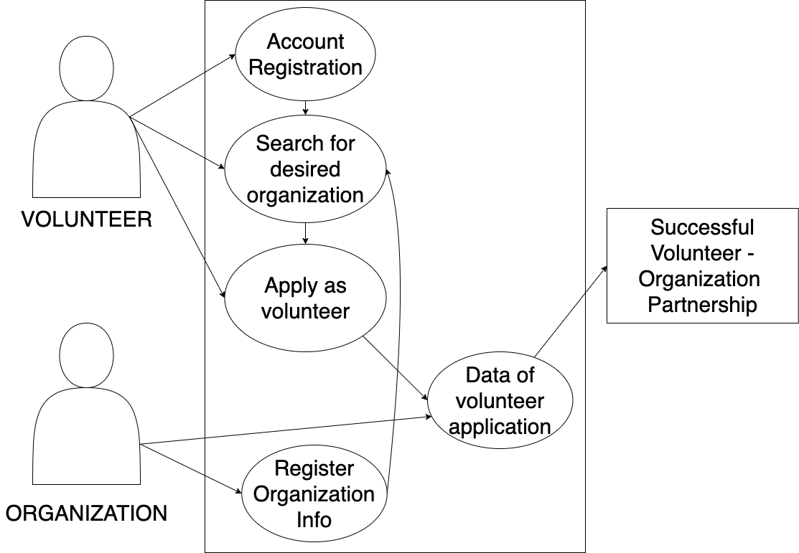
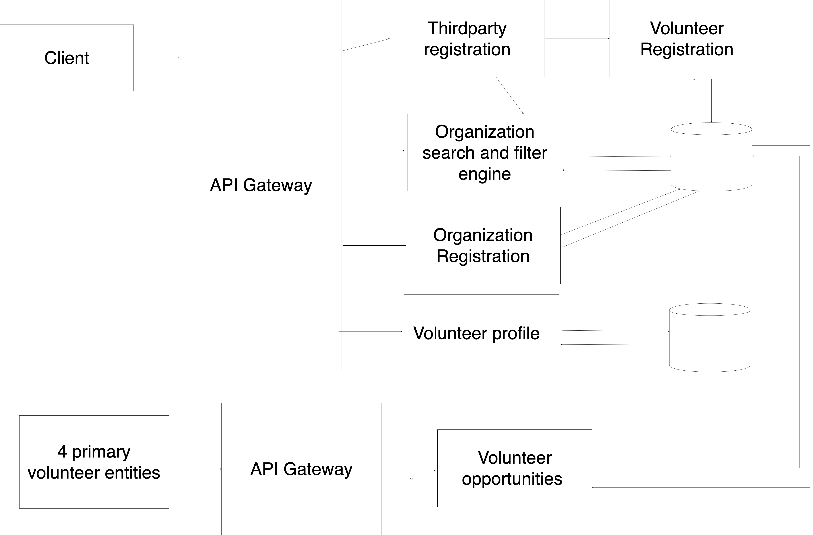

# Lab Report Template for CIS411_Lab1
Course: Messiah College CIS 411, Fall 2018
Instructors: [Joel Worrall](https://github.com/tangollama) & [Trevor Bunch](https://github.com/trevordbunch)
Name: YOUR NAME
GitHub: [jk1595](https://github.com/jk1595)

(if appropriate) Collaborators: [wesleycqy]

# Step 0: Reviewing Architectural Patterns
See the [lecture / discussion](https://docs.google.com/presentation/d/1nUcy63FWPFYO3OJmERJpMjEtdaFtaIBbuUkpmNRVRas/edit#slide=id.g45345bd5ea_0_136) from CIS 411. You'll need to be familiar with the content from this lecture to complete this assignment.

Note: you are free to work with classmates on this assignment. _Good architecture is born out of collaboration - not reclusive mad-scientist behavior._ However, if you work with colleagues:

1. You must specifically note your collaborators by name at the top of your report.
2. You may not completely copy each others work (diagrams and descriptions, even if your solutions are identical).

# Step 1: MVC Architecture
Review the proposals for the Serve Central project. Let's imagine that the project has been granted (relatively) unlimited resources if they can deliver a version 1 release in 120 days. As a result, the team decides to implement an MVC architecture for its version 1 release, delivering functionality through a [responsive web application](https://en.wikipedia.org/wiki/Responsive_web_design). 

Based on the [this](https://docs.google.com/presentation/d/1UnU0xU0wF1l8pAB8trtLpdM0yuskx66jTFJzd64nsjU/edit#slide=id.g439b9c6866_2_53) and [this](https://docs.google.com/presentation/d/1-VZfAFoBVr6ijNepKAtRA7JoAQsV2Jlbf2l1WPDMhI0/edit) presentation:

1) Document two use cases of your choosing

| Use Case #1 | |
|---|---|
| Title | As a volunteer, I want to search for service opportunities nearby so I can serve at the.|
| Description / Steps | 1. Enter the specific service I am interested in. 2. View the available organizations with its information and goals 3. Register online with email. |
| Primary Actor | Volunteer |
| Preconditions | Must have data of all organizations and its information in database. |
| Postconditions | Receive email regarding success of application |

| Use Case #2 | |
|---|---|
| Title | As an organization, I want to promote my organization and cause to as many people as possible. |
| Description / Steps | 1. Register as an organization. 2. Enter information about the cause and organization. 3.Input application information requirements. |
| Primary Actor | Organization |
| Preconditions | Website must allow organization to register and allow input for its information. |
| Postconditions | Receive an email notification of a new applicant. |

2) Highlight a [table](https://www.tablesgenerator.com/markdown_tables) of at least **four models, views, and controllers** needed to produce this project.

| Model (Data) (Object: Volunteer) | View (Page on app)| Controller (security gateway (event registration))|
|                  Model                 |           View           |                 Controller                    |
|----------------------------------------|--------------------------|-----------------------------------------------|
| Data of all registered organizations   |   List of organizations  | Enters page with selected organization's info |
| Data of all required application info  |   Input boxes for info   |    Submits application to the organization    |
|         Data of new applicant          |     Thank you message    |  Sends a confirmation email to the applicant  |
|        Data of individual users        | Pie chart of hours spent | Gives details about volunteering hours spent  |

3) Generate and [embed](https://github.com/adam-p/markdown-here/wiki/Markdown-Cheatsheet#images) at least one diagram of the interaction between an Actor from the Use Cases, and one set of Model(s), View(s), and Controller(s) from the proposed architecture, including all the related / necessary services (ex: data storage and retrieval, web servers, container tech, etc.)

_Note: You are free to use any diagraming tool and framework that you want as long as it clearly communicates the concept. I typically use a UML System Use Case or [UML Sequence Diagram](https://www.uml-diagrams.org/index-examples.html).  If you do not have a preferred diagramming tool: [draw.io](http://draw.io) or [lucidchart](http://lucidchart.com) are good cloud-based options._

# Step 2: Enhancing an Architecture
After an initial release and a few months of operation, Serve Central encounters a tremendous growth opportunity to extend their service and provide a volunteer recuitment and management interface to __four__ of the primary volunteer entities in the United States. As such, a reevaluation of the architecture is required, one that allows:

1. Thirdparty services to both input and retrieve data from the Serve Central model/datastore. (For instance, receiving volunteer opportunities from United Way chapters across the country.)
2. Building organization-specific interfaces on top of the Serve Central business and data logic. (For instance, allowing the registration services of Serve Central to be embedded in the website of local churches, [ah-la Stripe embedding](https://stripe.com/payments/elements).)

To support these objectives:
1. What architectural patterns (either of those presented in class on based on your own research) are appropriate? Justify your response, highlighting your presumed benefits / capabilties of your chosen architecture(s) **as well as as least one potential issue / adverse consequence** of your choice.

The Microservices Architecture would be a good pattern to incorporate the new requirements. It divides the program into smaller tasks so that it is easier to manage. We can allow thirdparty services to input and retrieve data from only the required sections instead of the whole program. It helps us establish well-defined boundaries in our data centers. We are able to create a small task just for the registration capability to be available on thirdparty websites. One potential issue is that the cloud may become imbalanced if the services are not largely independant.

2. Using your preferred diagramming tool, generate a diagram of the new Serve Central architecture that supports these two new requirements.

# Step 3: Scaling an Architecture
18 months into the future, Serve Central is experiencing profound growth in the use of the service with more than 100k daily, active users and nearly 1M event registrations per month. As a result, the [Gates Foundation](https://www.gatesfoundation.org/) has funded a project to build and launch a mobile application aimed at encouraging peer-to-peer volunteer opportunity promotion and organization. 

In addition to building a new mobile application interface, the grant requires that the project prepare for the following future needs:

1. Consuming bursts of 10k+ new volunteer opportunities per hour with a latency of less than 15 seconds between submitting an opportunity and it's availability in the registration service.
2. Supporting a volunteer and event data store that will quickly exceed 50TB of data
3. Allowing authorized parties to issue queries that traverse the TB's of data stored in your datastore(s).
4. Enabling researchers to examine patterns of volunteer opportunities as a way of determining future grant investments.

What archictural pattern(s) will you employee to support each of these needs? What will the benefits and consequences be? Why are changes needed at all? Justify your answers.

I would use the pipes and filters pattern because it allows tasks to run in parallel which means it can spread out the work load. This will help get things done faster due to the big increase in data flow. It will also make the system more resilient. If a filter or machine fails, it can reschedule the work to another instance of the component. One of the problems with this method is that it can get very complicated due to the many pipes and filters. Also, if a filter fails and is rescheduled to another filter, it can cause the filters to process the same data twice.                                          

# Extra Credit
1. Create and embed a comprehensive diagram of your final architecture (i.e. one that meets all the requirements of this lab, including Step 3).

2. Augment/improve the assignment. Suggest meaningful changes in the assignment and highlight those changes in the extra credit portion of your lab report.