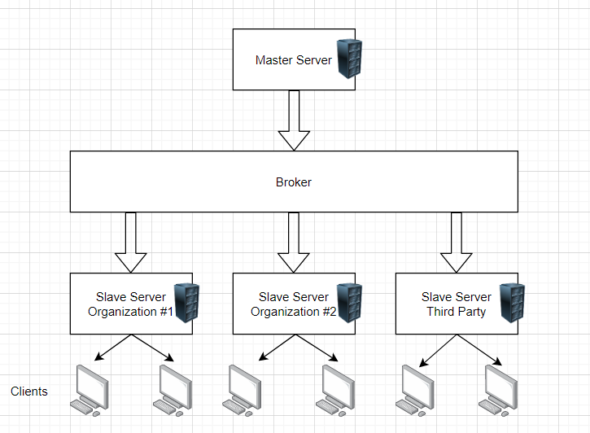

# Lab Report Template for CIS411_Lab1
Course: Messiah College CIS 411, Fall 2018
Instructors: [Joel Worrall](https://github.com/tangollama) & [Trevor Bunch](https://github.com/trevordbunch)
Name: YOUR NAME
GitHub: [YOUR_HANDLE](https://github.com/YOUR_HANDLE)
(if appropriate) Collaborators: [Names of colleagues you worked with on this assignment]

Collaborated with Bryce Doane on Steps 2 and 3 of this lab

# Step 0: Reviewing Architectural Patterns
See the [lecture / discussion](https://docs.google.com/presentation/d/1nUcy63FWPFYO3OJmERJpMjEtdaFtaIBbuUkpmNRVRas/edit#slide=id.g45345bd5ea_0_136) from CIS 411. You'll need to be familiar with the content from this lecture to complete this assignment.

Note: you are free to work with classmates on this assignment. _Good architecture is born out of collaboration - not reclusive mad-scientist behavior._ However, if you work with colleagues:

1. You must specifically note your collaborators by name at the top of your report.
2. You may not completely copy each others work (diagrams and descriptions, even if your solutions are identical).

# Step 1: MVC Architecture
Review the proposals for the Serve Central project. Let's imagine that the project has been granted (relatively) unlimited resources if they can deliver a version 1 release in 120 days. As a result, the team decides to implement an MVC architecture for its version 1 release, delivering functionality through a [responsive web application](https://en.wikipedia.org/wiki/Responsive_web_design). 

Based on the [this](https://docs.google.com/presentation/d/1UnU0xU0wF1l8pAB8trtLpdM0yuskx66jTFJzd64nsjU/edit#slide=id.g439b9c6866_2_53) and [this](https://docs.google.com/presentation/d/1-VZfAFoBVr6ijNepKAtRA7JoAQsV2Jlbf2l1WPDMhI0/edit) presentation:

1) Document two use cases of your choosing

| Use Case #1 | |
|---|---|
| Title | Account for Volunteers |
| Description / Steps | Users should be able to create and customize their account with their information (name, age, skills, location) to one-click send their information to places they want to volunteer. For a volunteer, the app should be able to have sort features to sort by position available and location of the position.|
| Primary Actor | Community Members / Volunteers |
| Preconditions | At least one nonprofit must exist with at least one position currently open. User profile must be complete. |
| Postconditions | Send confirmation email or notification after a user signs up for event and is approved by company.  |

| Use Case #2 | |
|---|---|
| Title | Account for Organizations |
| Description / Steps | Organization should be able to create an account and specify a location where they are located. After account creation, they can create listing/applications to try to recruit a volunteer. These applications must include position title, description, and recommended skills list.  |
| Primary Actor | Companies / Nonprofits looking for volunteers |
| Preconditions | App signup feature must work and be available to companies. Company must complete profile before creating a listing. |
| Postconditions | App will deliver email or notification for each volunteer applicant. Clicking on notification will take user to page to view their profile and accept/decline easiliy. |


2) Highlight a [table](https://www.tablesgenerator.com/markdown_tables) of at least **four models, views, and controllers** needed to produce this project.

| Model | View | Controller |
|---|---|---|
| Volunteer Account Registration - name, address, interests, skills, age | Registration page with textboxes for entering information | Takes information entered into user input fields, forms a SQL insert statement to commit information to a database, takes user to a confirmation page and redirects to a list of potential positions based on submitted skills and interests. |
| Company Account Registration - name, address, organization type/category, hours of operation, about us section | Registration page with textboxes for entering information | Takes information entered into user input fields, forms a SQL insert statement to commit information to a database, takes user to a confirmation page and redirects to a page for creating their first event. |
| Event Object- tied to a company account. Date, time, location, description, number of volunteers needed, skills wanted | Digital form to fill out that has textboxes for each field to enter data. | Takes information entered into user input fields, forms a SQL insert statement to commit information to a database. Will then show the company the view of their event page that the volunteers will see.  |
| Search Function - for volunteer accounts. Sort listings by date, skills, interests, and location | List of events that the user can scroll through. At top, there is a seach bar and filters to narrow results. | When a volunteer logs in, they are taken to the main results page. From there, they can browse the recommended results or they can use the search and filter functionality to narrow the results. Users can tap on a listing for more information and view a button to sign up.  |

3) Generate and [embed](https://github.com/adam-p/markdown-here/wiki/Markdown-Cheatsheet#images) at least one diagram of the interaction between an Actor from the Use Cases, and one set of Model(s), View(s), and Controller(s) from the proposed architecture, including all the related / necessary services (ex: data storage and retrieval, web servers, container tech, etc.)


_Note: You are free to use any diagraming tool and framework that you want as long as it clearly communicates the concept. I typically use a UML System Use Case or [UML Sequence Diagram](https://www.uml-diagrams.org/index-examples.html).  If you do not have a preferred diagramming tool: [draw.io](http://draw.io) or [lucidchart](http://lucidchart.com) are good cloud-based options._

# Step 2: Enhancing an Architecture
After an initial release and a few months of operation, Serve Central encounters a tremendous growth opportunity to extend their service and provide a volunteer recuitment and management interface to __four__ of the primary volunteer entities in the United States. As such, a reevaluation of the architecture is required, one that allows:

1. Thirdparty services to both input and retrieve data from the Serve Central model/datastore. (For instance, receiving volunteer opportunities from United Way chapters across the country.)
2. Building organization-specific interfaces on top of the Serve Central business and data logic. (For instance, allowing the registration services of Serve Central to be embedded in the website of local churches, [ah-la Stripe embedding](https://stripe.com/payments/elements).)

To support these objectives:
1. What architectural patterns (either of those presented in class on based on your own research) are appropriate? Justify your response, highlighting your presumed benefits / capabilties of your chosen architecture(s) **as well as as least one potential issue / adverse consequence** of your choice.
```
I think that using a broker architecture would best suit the needs of this growth due to its ability to decouple services so an API could be provided to a third party. It would also allow for each organization to have its own server, which could then communicate with a master server in a master-slave network. One potential issue with this type of architecture would be the code would have to be decomposable into smaller problems and portions to run on the slave servers. Broker systems also have a lower fault tolerance, since if the broker goes down, the entire system would not be able to communicate. 

The slave servers can be customized by each organization and the third party can decide what data to pull to their server. The broker is a layer that sits between the master server and the slave servers and controls the data flow. This allows for scaling, customizability, and better data control within the network. 
```

2. Using your preferred diagramming tool, generate a diagram of the new Serve Central architecture that supports these two new requirements.



# Step 3: Scaling an Architecture
18 months into the future, Serve Central is experiencing profound growth in the use of the service with more than 100k daily, active users and nearly 1M event registrations per month. As a result, the [Gates Foundation](https://www.gatesfoundation.org/) has funded a project to build and launch a mobile application aimed at encouraging peer-to-peer volunteer opportunity promotion and organization. 

In addition to building a new mobile application interface, the grant requires that the project prepare for the following future needs:

1. Consuming bursts of 10k+ new volunteer opportunities per hour with a latency of less than 15 seconds between submitting an opportunity and it's availability in the registration service.
2. Supporting a volunteer and event data store that will quickly exceed 50TB of data
3. Allowing authorized parties to issue queries that traverse the TB's of data stored in your datastore(s).
4. Enabling researchers to examine patterns of volunteer opportunities as a way of determining future grant investments.

What archictural pattern(s) will you employee to support each of these needs? What will the benefits and consequences be? Why are changes needed at all? Justify your answers.

```
A solution similar to Docker Architecture would be a solution for this need. Docker uses an advanced client-server architecture where the servers are based on containers so containers can be easily deployed and taken down as needed to help scale for periods of rapid growth. One consequence of using a client-server architecture would be that this type of network is more expensive do deploy. This also means that if the main docker container that replicates itself onto other servers goes down, the entire website would go down. 
These changes would be need to be made because the rapid growth would require the system to scale up and down as needed to account for bursts of users all signing up at once. The broker system would not allow for this kind of scaling, hence the change in type of architecture that would be required.
```

# Extra Credit
1. Create and embed a comprehensive diagram of your final architecture (i.e. one that meets all the requirements of this lab, including Step 3).
2. Augment/improve the assignment. Suggest meaningful changes in the assignment and highlight those changes in the extra credit portion of your lab report.