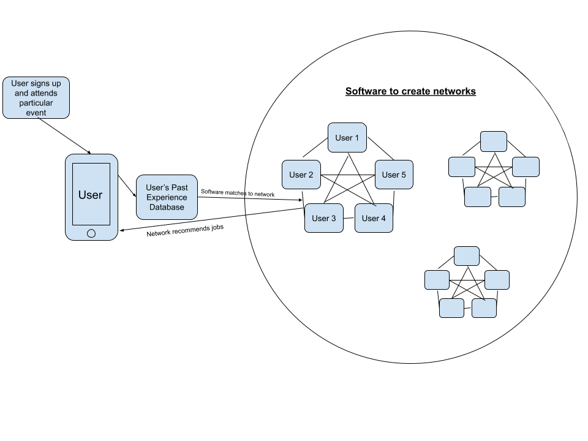
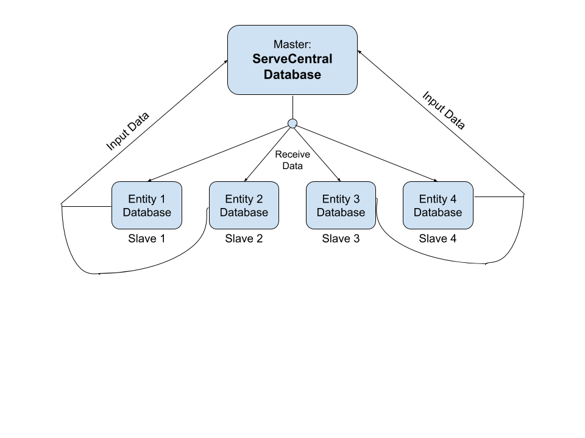
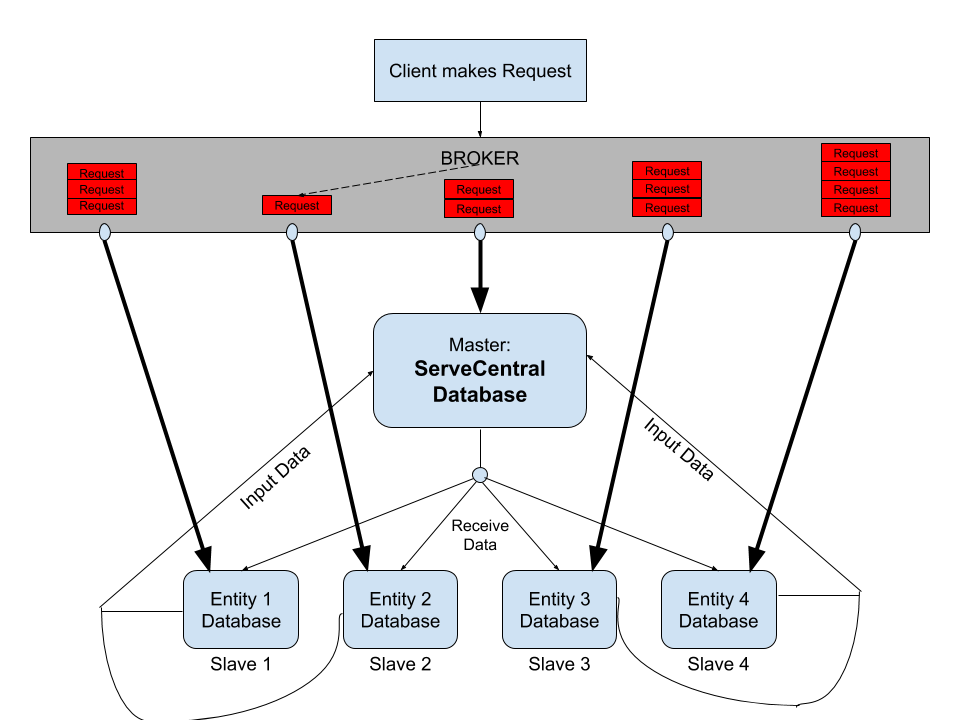

# Lab Report Template for CIS411_Lab1
Course: Messiah College CIS 411, Fall 2018
Instructors: [Joel Worrall](https://github.com/tangollama) & [Trevor Bunch](https://github.com/trevordbunch)
Name: Wesley Chong
GitHub: [Wesley Chong](https://github.com/wesleycqy)
Collaborators: Joshua Keong

# Step 0: Reviewing Architectural Patterns
See the [lecture / discussion](https://docs.google.com/presentation/d/1nUcy63FWPFYO3OJmERJpMjEtdaFtaIBbuUkpmNRVRas/edit#slide=id.g45345bd5ea_0_136) from CIS 411. You'll need to be familiar with the content from this lecture to complete this assignment.

Note: you are free to work with classmates on this assignment. _Good architecture is born out of collaboration - not reclusive mad-scientist behavior._ However, if you work with colleagues:

1. You must specifically note your collaborators by name at the top of your report.
2. You may not completely copy each others work (diagrams and descriptions, even if your solutions are identical).

# Step 1: MVC Architecture
Review the proposals for the Serve Central project. Let's imagine that the project has been granted (relatively) unlimited resources if they can deliver a version 1 release in 120 days. As a result, the team decides to implement an MVC architecture for its version 1 release, delivering functionality through a [responsive web application](https://en.wikipedia.org/wiki/Responsive_web_design). 

Based on the [this](https://docs.google.com/presentation/d/1UnU0xU0wF1l8pAB8trtLpdM0yuskx66jTFJzd64nsjU/edit#slide=id.g439b9c6866_2_53) and [this](https://docs.google.com/presentation/d/1-VZfAFoBVr6ijNepKAtRA7JoAQsV2Jlbf2l1WPDMhI0/edit) presentation:

1) Document two use cases of your choosing

| Use Case #1 | |
|---|---|
| Title |As a user, I want to browse recommended volunteer opportunities|
| Description / Steps | The first step the user takes is to open the app. The first screen they see are their future scheduled activities. By clicking the "recommended" button, the user is able to see various potential events based on a certain location radius as well as previous volunteer participation. At the very least, the user must be able to view basic information such as Title, Time & Location, Description, and Contact Number of the event on this page without the need of clicking into them to find out more. |
| Primary Actor | User/Want-to-be Volunteer |
| Preconditions |1. Opportunities to be posted up with their location available 2. Previous experience to be matched with others' previous experience in order to give suggestions for future volunteer jobs 3. For the user to enter what location they are interested in or for them to enable automatic location detection. |
| Postconditions |1. User to be able to find out more by clicking "find out more" 2. For the user's "previous experience" to be updated based on which experiences they signed up for in order to improve future "recommended" suggestions for themselves as well as other users. |

| Use Case #2 | |
|---|---|
| Title | As a user |
| Description / Steps | |
| Primary Actor | |
| Preconditions | |
| Postconditions | |

2) Highlight a [table](https://www.tablesgenerator.com/markdown_tables) of at least **four models, views, and controllers** needed to produce this project.

| Model (data)| View (screen of search results)| Controller |
|---|---|---|
|Information of every user's previous experience|Screen displaying "recommended" jobs|Sofware that __create network__ of users with similar jobs and recommending them to other users in the network|
| Information of a community's volunteer opportunities. | List of all events on a "profile page". | Listing page for companies to upload volunteer opportunities to database. Includes Title, Date & Time, Location, Job Description, and any other relevant information.  |
| Every respective user's location/region they are looking to serve in. | An address at the top of the volunteer's page listing their address. | 1. Auto-location detection of each user's rough location.  2. Option for user to change location from the automatically set location. |
| A user's approximate physical ability. | Online form every user must fill up stating age, physical conditions, medical conditions, among other factors. | A formula giving each user a "physical score" and recommending jobs based on them. |

3) Generate and [embed](https://github.com/adam-p/markdown-here/wiki/Markdown-Cheatsheet#images) at least one diagram of the interaction between an Actor from the Use Cases, and one set of Model(s), View(s), and Controller(s) from the proposed architecture, including all the related / necessary services (ex: data storage and retrieval, web servers, container tech, etc.) 

# Step 2: Enhancing an Architecture
After an initial release and a few months of operation, Serve Central encounters a tremendous growth opportunity to extend their service and provide a volunteer recuitment and management interface to __four__ of the primary volunteer entities in the United States. As such, a reevaluation of the architecture is required, one that allows:

1. Thirdparty services to both input and retrieve data from the Serve Central model/datastore. (For instance, receiving volunteer opportunities from United Way chapters across the country.)
2. Building organization-specific interfaces on top of the Serve Central business and data logic. (For instance, allowing the registration services of Serve Central to be embedded in the website of local churches, [ah-la Stripe embedding](https://stripe.com/payments/elements).)

To support these objectives:
To support the sudden growth of Serve Central, I believe a <ins>**MASTER-SLAVE**</ins> architectural pattern is suitable. In this infrastructure, the "Master" would still be ServeCentral, while the "Slaves" will be the 4 primary entities that will be synced to the Master databse. 
  __Benefits:__ 
    1. Allows for ServeCentral database to still be in control as a Master, but able to distribute the heavy load to the 4 different slaves. 
    2. Gives the 4 volunteer bodies a certain level of authority over their own fields.  
    3. This would also allow for each entity to build interfaces based off of ServeCentral data. They are able to use the synchronized database from Master to do this.  
    4. Allows the 4 organizations to do more than they used to, such volunteer recruitment, with ServeCentral data which they did not have before.  
    5.  Easy to switch from MVC to Master-Slave compared to other architextures. 

__Issue/Concern:__  
    1. Master and Slaves may not be conitnuously synchronized, presenting certain integration issues. Slaves may not always provide the most up to date information causing problems when information travels "down the line". 
    2. Slaves are working in isolation which may also present problems in transmission of information "up the line".

# Step 3: Scaling an Architecture
18 months into the future, Serve Central is experiencing profound growth in the use of the service with more than 100k daily, active users and nearly 1M event registrations per month. As a result, the [Gates Foundation](https://www.gatesfoundation.org/) has funded a project to build and launch a mobile application aimed at encouraging peer-to-peer volunteer opportunity promotion and organization. 

In addition to building a new mobile application interface, the grant requires that the project prepare for the following future needs:

1. Consuming bursts of 10k+ new volunteer opportunities per hour with a latency of less than 15 seconds between submitting an opportunity and it's availability in the registration service.
2. Supporting a volunteer and event data store that will quickly exceed 50TB of data
3. Allowing authorized parties to issue queries that traverse the TB's of data stored in your datastore(s).
4. Enabling researchers to examine patterns of volunteer opportunities as a way of determining future grant investments.

 
Most suitable architecture: <ins>BROKER</ins> 
By implementing a Broker architextural pattern, It will allow the system to deal with the massive amount of new users. In addition to this, the latency will also be reduced as the Broker is able to "direct traffic".

__Benefits__ 
    1. Retains all benefits of Master-Slave architectural pattern. 
    2. Allows data transfer to be distributed evenly among all the slaves regardless of the amount of requests going through. Able to handle over 100,000 users daily due to weight split evenly to 5 different databases. 
    3. Database of each entity to be able to access data, both from their own server as well as other slaves through Master. 
    4. Addition of only one element (Broker) to the original Master-Slave architecture.  
    

# Extra Credit
1. Create and embed a comprehensive diagram of your final architecture (i.e. one that meets all the requirements of this lab, including Step 3). 

2. Augment/improve the assignment. Suggest meaningful changes in the assignment and highlight those changes in the extra credit portion of your lab report.
 
    1. Allow diagram drawing to be submitted on paper/in-class because drawing on a computer is fairly difficult. 
    2. "Step 4": Come up with a brand new, never-seen-before architectural pattern and list 1 benefit and 1 flaw about it. 
    3. For this class about architectural patterns to be taught before Project Inception due date. 